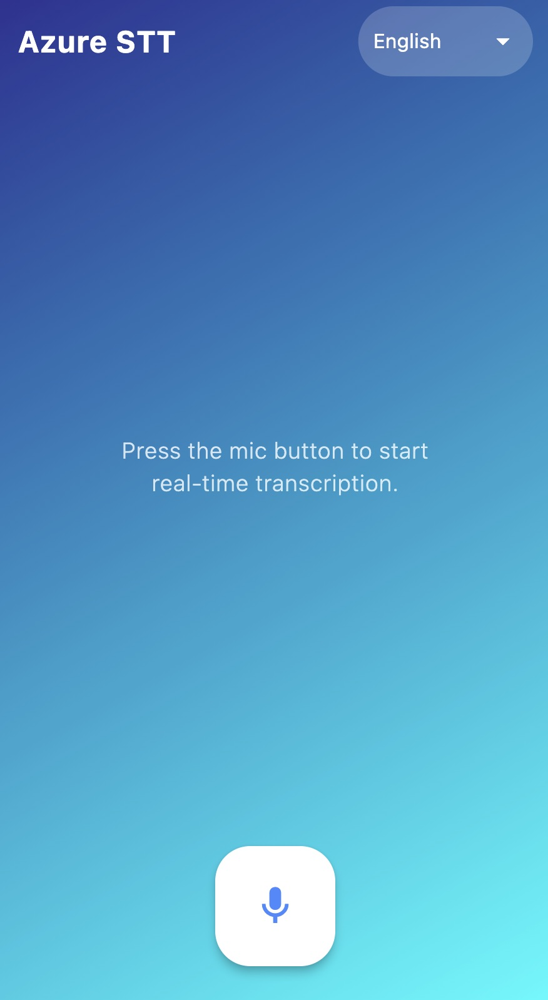
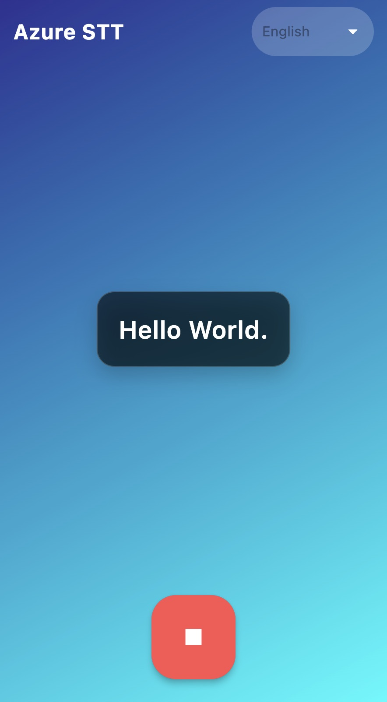

# Azure STT Flutter

A Flutter package for real-time Speech-to-Text (transcription) using Microsoft Azure Cognitive Services. This library provides a reactive, stream-based API built with the BLoC/Cubit pattern to easily integrate speech recognition into your Flutter applications.

## Features

*   **Real-time Transcription**: Receive intermediate results (hypothesis) and finalized text as the user speaks.
*   **Cross-Platform**: Supports Mobile (iOS, Android), Desktop (macOS, Windows, Linux), and Web.
*   **Auto-Silence Timeout**: Automatically clears the text after a configurable period of silence.
*   **Multi-Language**: Supports all languages provided by Azure Speech Services.


## Example app

An example app is included in the package:

<p >
  
  
</p>

## Getting Started

### 1. Dependencies

Add the package to your `pubspec.yaml`:

```yaml
dependencies:
  azure_stt_flutter:
    path: ./ # Or git url
```

### 2. Permissions

**Android**

Add the microphone permission to `android/app/src/main/AndroidManifest.xml`:

```xml
<uses-permission android:name="android.permission.RECORD_AUDIO" />
<uses-permission android:name="android.permission.INTERNET" />
```

**iOS**

Add the microphone usage description to `ios/Runner/Info.plist`:

```xml
<key>NSMicrophoneUsageDescription</key>
<string>This app needs access to the microphone for speech recognition.</string>
```

**macOS**

Add the microphone entitlement to `macos/Runner/DebugProfile.entitlements` and `Release.entitlements`:

```xml
<key>com.apple.security.device.audio-input</key>
<true/>
```

## Usage

### Initialization

Initialize the `AzureSpeechToText` instance. You need a **Subscription Key**

```dart
final azureStt = AzureSpeechToText(
  subscriptionKey: 'YOUR_AZURE_KEY',
  region: 'westeurope', // or other supported region
  language: 'en-US',
  textClearTimeout: const Duration(seconds: 2),
);
```

### Listening to Updates

The library exposes a `transcriptionStateStream` which emits `TranscriptionState` updates.

```dart
StreamBuilder<TranscriptionState>(
  stream: azureStt.transcriptionStateStream,
  builder: (context, snapshot) {
    final state = snapshot.data;
    if (state == null) return SizedBox();

    return Column(
      children: [
        // Combined text (finalized + intermediate)
        Text(state.text),

        // Or access them separately
        // Text(state.intermediateText), // Changing hypothesis
        // Text(state.finalizedText.join(' ')), // Confirmed sentences
      ],
    );
  },
)
```

### Controls

```dart
// Start listening
await azureStt.startListening()

// Stop listening
azureStt.stopListening()

// Check if listening
azureStt.isListening()

// Dispose when done
azureStt.dispose()
```

## Architecture

The library is built using the **BLoC/Cubit** pattern to manage the state of the transcription.

### TranscriptionCubit
The central state manager. It processes events from the Azure Service and emits `TranscriptionState`.

### TranscriptionState
An immutable object containing:
*   **`intermediateText`**: The real-time, changing text (hypothesis) that Azure sends while you are speaking.
*   **`finalizedText`**: A list of completed sentences (phrases) that Azure has confirmed.
*   **`text`**: A helper field that combines finalized and intermediate text for easier display.
*   **`isListening`**: A boolean indicating if the microphone is active.

### Data Flow
1.  **Microphone**: Captures audio as a stream of bytes.
2.  **Service**: `AzureSttService` listens to the mic stream and forwards audio chunks to Azure via WebSocket.
3.  **Azure**: Sends back JSON events (Hypothesis or Phrase).

## Authentication

The library handles authentication differently depending on the platform due to browser limitations.

### Mobile & Desktop
*   **Mechanism**: The library uses the Subscription Key to get a short-lived **Access Token** from Azure.
*   **Connection**: It connects to the Azure WebSocket URL, passing this token in the **HTTP Authorization Header** (`Authorization: Bearer <token>`). This is the standard, secure way.

### Web
*   **Limitation**: Standard browser WebSocket APIs do not allow setting custom HTTP headers during the handshake.
*   **Solution**: The library connects to the Azure WebSocket URL but passes the authentication credentials directly in the **URL Query Parameters**.
*   **Security Note**: Because query parameters can potentially be logged, using the **Token Fetcher** approach (generating tokens on your backend) is highly recommended for Web deployments to avoid exposing your long-lived Subscription Key.

## License

This project is licensed under the MIT License - see the [LICENSE](LICENSE) file for details.
